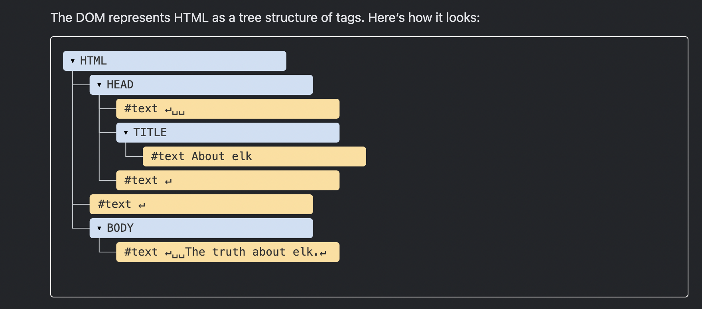

## Two Parts of window

    - First, it is a global object for JavaScript code.
    - Second, it represents the “browser window” and provides methods to control it.

Note: documnet is the entry point of the DOM

## BOM - Browser object Model:

- The Browser Object Model (BOM) in web development refers to the collection of browser-specific objects exposed by the web browser's environment. These objects provide JavaScript access to the browser's window, document, location, history, and other browser-related features. The BOM is distinct from the Document Object Model (DOM), which represents the structure and content of the web page itself.

According to DOM every HTML tag is object

An HTML/XML document is represented inside the browser as the DOM tree.

Tags become element nodes and form the structure.
Text becomes text nodes.
…etc, everything in HTML has its place in DOM, even comments.
We can use developer tools to inspect DOM and modify it manually.
