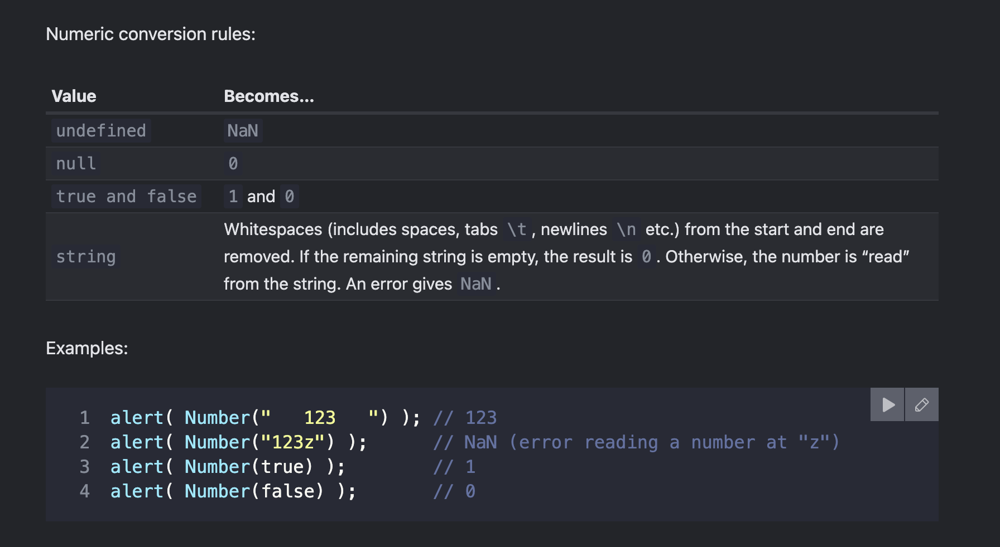

Value Becomes…
undefined NaN
null 0
true and false 1 and 0
string Whitespaces (includes spaces, tabs \t, newlines \n etc.) from the start and end are removed. If the remaining string is empty, the result is 0. Otherwise, the number is “read” from the string. An error gives NaN.

# Summary

- The three most widely used type conversions are to string, to number, and to boolean.

- String Conversion – Occurs when we output something. Can be performed with String(value). The conversion to string is usually obvious for primitive values.

- Numeric Conversion – Occurs in math operations. Can be performed with Number(value).
